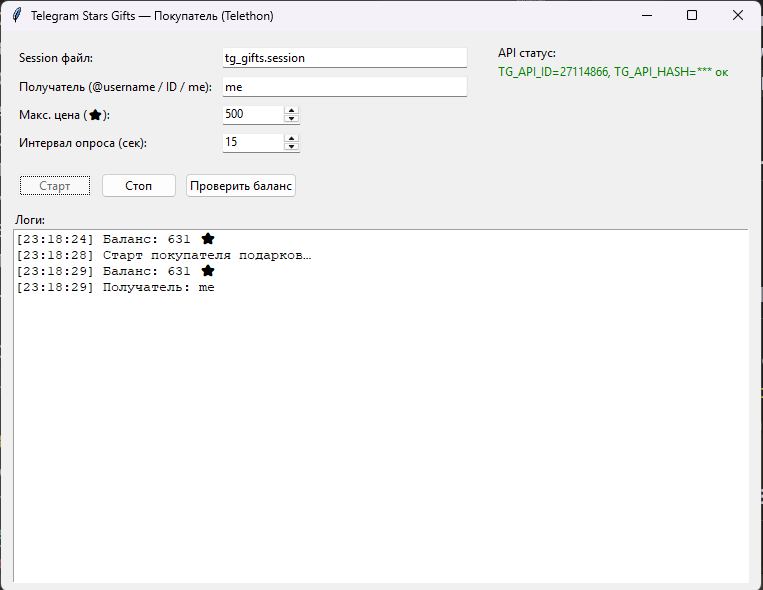

# Telegram Stars Gifts — Покупатель (GUI на Tkinter)

Этот проект — графический интерфейс для автоматической покупки лимитных подарков в Telegram с использованием звёзд (Stars) через Telethon.

## Возможности
- Автоматическая проверка новых лимитных подарков.
- Покупка сначала дорогих подарков (если хватает средств), затем более дешёвых.
- Поддержка покупки нескольких подарков за один цикл при достаточном балансе.
- Гибкая настройка максимальной цены и интервала опроса.
- GUI на Tkinter с выводом логов и кнопками управления.
- Проверка текущего баланса Stars в один клик.

## Установка
```bash
pip install telethon python-dotenv
```

## Настройка
Создайте файл `.env` в корневой папке проекта и заполните его:
```env
TG_API_ID=123456
TG_API_HASH=xxxxxxxxxxxxxxxxxxxxxxxxxxxxxxxx
TG_SESSION=tg_gifts.session     # опционально, имя файла сессии
RECIPIENT=me                    # получатель подарков (username, ID или 'me')
MAX_PRICE_STARS=500             # максимальная цена подарка
POLL_INTERVAL=15                # интервал опроса (сек)
```

## Запуск
```bash
python tg_star_gifts_ui.py
```
При первом запуске потребуется авторизация в Telegram — в консоли введите код подтверждения и (если есть) пароль.

## Как работает логика покупок
1. Запрашивает список лимитных подарков.
2. Отбирает только доступные (не распроданные) и дешевле или равные `MAX_PRICE_STARS`.
3. Сортирует их по цене **по убыванию**.
4. Покупает сначала самые дорогие, пока хватает Stars.
5. Если остаётся баланс — покупает более дешёвые.
6. После цикла, если ничего не куплено — ждёт `POLL_INTERVAL` секунд.

## Скриншот


## Зависимости
- Python 3.8+
- [Telethon](https://github.com/LonamiWebs/Telethon)
- [python-dotenv](https://pypi.org/project/python-dotenv/)

## Лицензия
MIT
